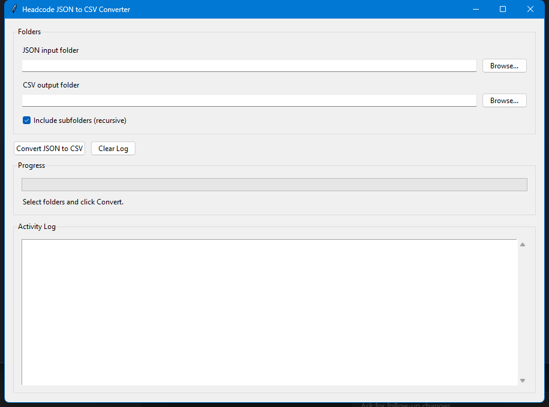

# Tooling: JSON and Dummy Export Helpers

This folder contains helper scripts for data export workflows around Headcode reference data.

## 1) JSON to CSV (GUI)

Script: `json_to_csv_gui.py`

Use this when you have `reference/*.json` files and want editable CSV copies.

### Run

```bash
python tool/json_to_csv_gui.py
```

### Quick Usage

1. Choose the **JSON input folder** (for example, a `reference` folder from a full backup).
2. Choose the **CSV output folder**.
3. Leave **Include subfolders (recursive)** enabled if your JSON files are nested.
4. Click **Convert JSON to CSV**.
5. Watch progress and any errors in the **Activity Log**.

### What it handles

- `list[object]` JSON (common for Headcode reference files) -> one CSV row per object.
- Plain object JSON -> one CSV row.
- Lists/scalars -> exported into a single `value` column.
- Nested objects are flattened with `.` keys (example: `meta.source`).
- Nested arrays/objects are stored as JSON text in cells.

### Screenshots

Main window:



---

## 2) Dummy Headcode FULL Export Generator

Script: `generate_headcode_dummy_export.py`

Generates a realistic multi-year dummy dataset containing:

- `spots.csv` (matching full export schema)
- companion CSVs (`classes.csv`, `types.csv`, etc.)
- `reference/*.json` files for full-backup compatibility

### Run

```bash
python tool/generate_headcode_dummy_export.py
```

Optional:

```bash
python tool/generate_headcode_dummy_export.py --output-dir dummy_data/headcode_full_export_3y --seed 20260322
```
